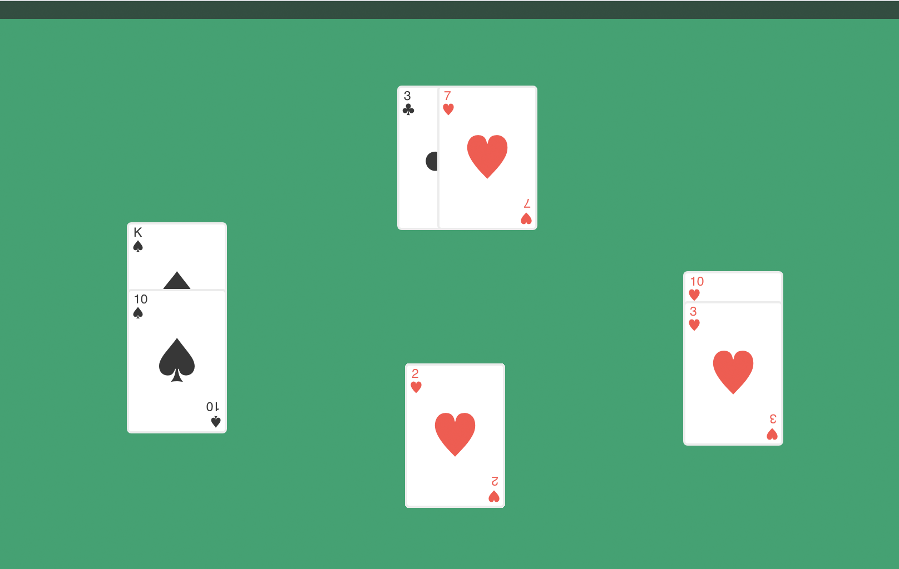

# Deck-of-Cards
a deck-of-cards javascript class, which comes with a Vue.js UI



### Project setup
```
npm install
npm run serve
```
### To-Do List

* Toggle back and front of card.
* Add buttons to shuffle and reset deck.
* Performance optimization.
* Implement testing.

## Copyright and license

Code and documentation copyright 2020 the author. Code released under the [MIT license](LICENSE). Docs released under [Creative Commons](docs/LICENSE).</pre>
